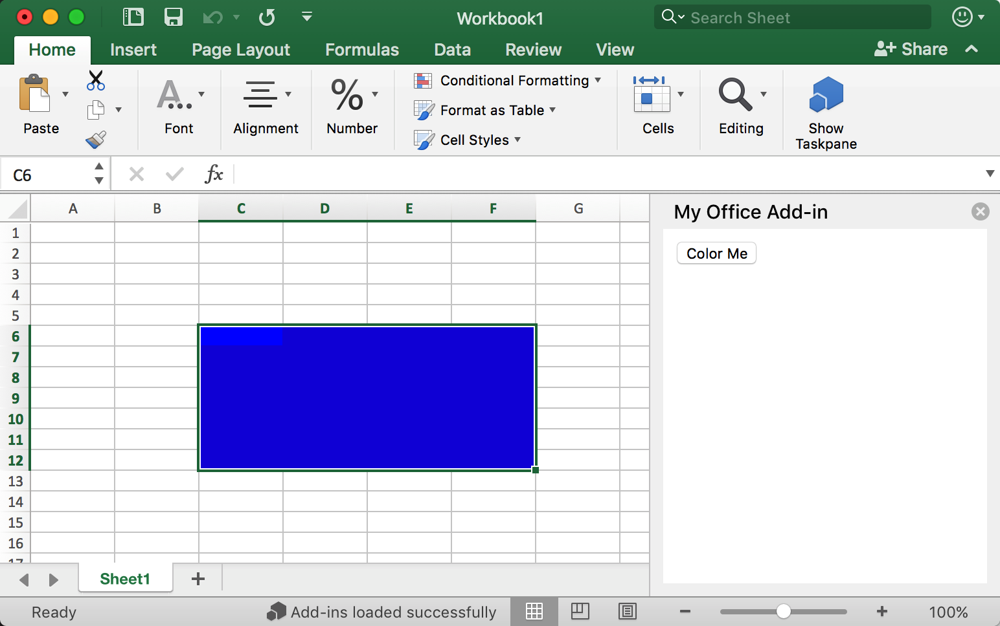

# Build an Add-in with Angular

### Step 1. Generate the Angular project by **Angular CLI**

If you never install [Angular CLI](https://github.com/angular/angular-cli) before, first install it globally.

```bash
npm install -g @angular/cli
```

Then generate your Angular app by

```bash
ng new my-addin
```

### Step 2. Generate the manifest file by **Office Toolbox**

If you never installed [Office Toolbox](https://needupdate) before, first install it globally.

```bash
npm install -g office-toolbox
```

If you installed it before, go to your app folder.

```bash
cd my-addin
```

Generate the manifest file following the steps below.

```bash
office-toolbox
```


You should be able to see your manifest file with the name ends with **manifest.xml**.

Open it and replace all `https://localhost:3000` to `http://localhost:4200` in the generated manifest file.

### Step 3. Initialize

Open **src/index.html**, add

```html
<script src="https://appsforoffice.microsoft.com/lib/beta/hosted/office.debug.js"></script>
```

before `</head>` tag.

Open **src/main.ts**, and replace

```typescript
platformBrowserDynamic().bootstrapModule(AppModule)
  .catch(err => console.log(err));
```

with the following:

```typescript
declare const Office: any;

Office.initialize = () => {
  platformBrowserDynamic().bootstrapModule(AppModule)
    .catch(err => console.log(err));
};
```

If you are using Windows, since the add-in platform uses Internet Explorer, uncomment these lines in **src/polyfills.ts**.

```typescript
import 'core-js/es6/symbol';
import 'core-js/es6/object';
import 'core-js/es6/function';
import 'core-js/es6/parse-int';
import 'core-js/es6/parse-float';
import 'core-js/es6/number';
import 'core-js/es6/math';
import 'core-js/es6/string';
import 'core-js/es6/date';
import 'core-js/es6/array';
import 'core-js/es6/regexp';
import 'core-js/es6/map';
import 'core-js/es6/weak-map';
import 'core-js/es6/set';

### Step 4. Add "Color Me"

Open **src/app/app.component.html**. Replace by

```html
<button (click)="onColorMe()">Color Me</button>
```

Open **src/app/app.component.ts**. Replace by

```typescript
import { Component } from '@angular/core';

declare const Excel: any;

@Component({
  selector: 'app-root',
  templateUrl: './app.component.html',
  styleUrls: ['./app.component.css']
})
export class AppComponent {
  onColorMe() {
    Excel.run(async (context) => {
      const range = context.workbook.getSelectedRange();
      range.format.fill.color = 'green';
      await context.sync();
    });
  }
}
```

### Step 5. Run the app

Run the dev server through the terminal.

```bash
npm start
```

or

```bash
ng serve
```

### Step 6. Side load the manifest file by **Office Toolbox**

To run the add-in, you need side-load the add-in in the Excel.

Run this in terminal and following the steps below.

```bash
office-toolbox
```


It will open Excel. Click the 'Show Taskpane' button on the 'Home' tab to open your add-in.

Select the range and click **Color Me** button.



Congratulations you just finish your first Angular add-in for Excel!

